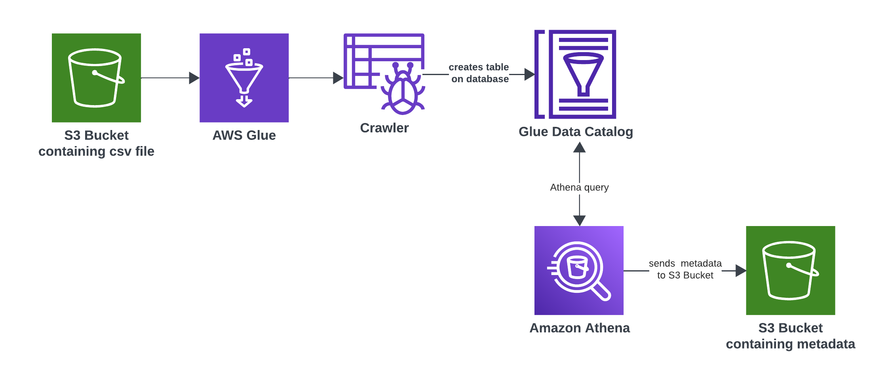
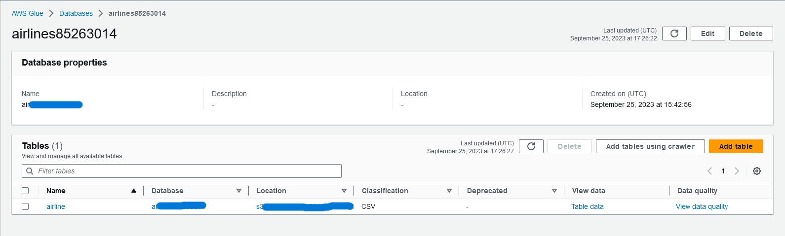
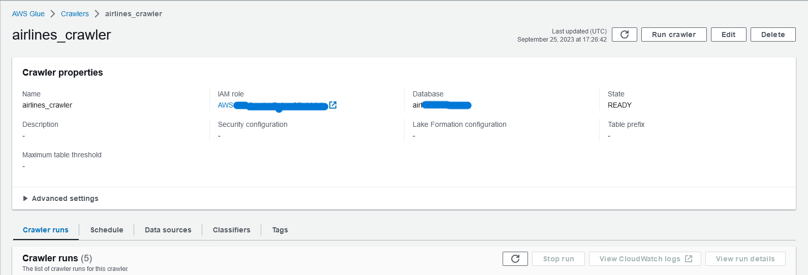
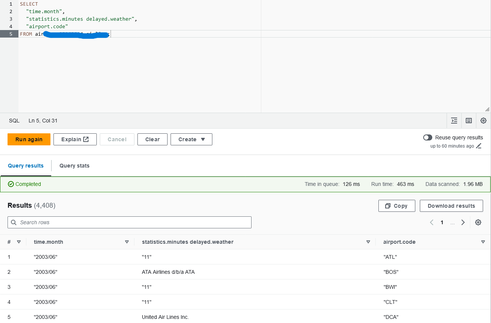
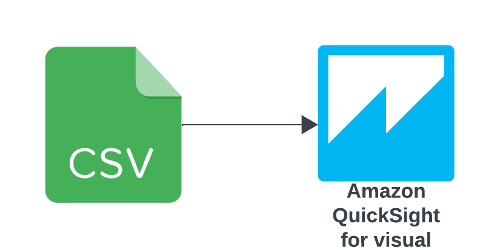
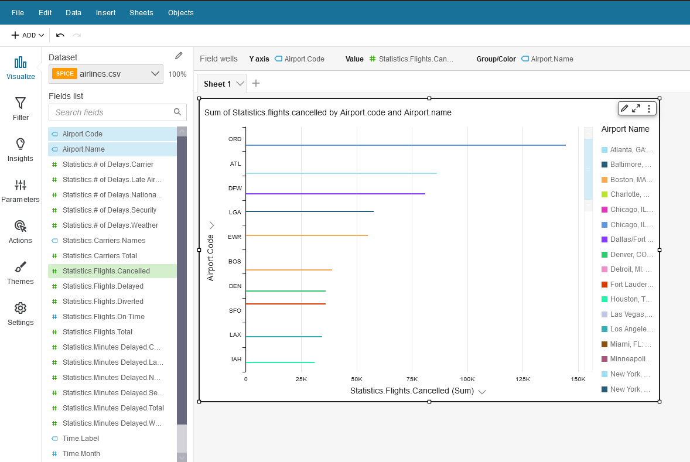

# Introduction

Here we will run ETL jobs with AWS Glue with AWS S3 as source, quering with Athena and visualizing with Amazon Quicksight

## Table of Contents

- [Introduction](#introduction)
- [Terraform Automation](#terraform-automation)
- [Steps for Glue and Athena](#steps-for-glue-and-athena)
- [Steps for Quicksight](#steps-for-quicksight)

## Steps for Glue and Athena


>dataflow

- First create a S3 bucket and upload the `airlines.csv` file containing the data.

- Create an IAM role with the following policy (replace `your-bucket-name` with your actual S3 bucket name):

```yaml
{
    "Version": "2012-10-17",
    "Statement": [
        {
            "Effect": "Allow",
            "Action": [
                "s3:GetObject",
                "s3:PutObject",
                "s3:ListBucket"
            ],
            "Resource": [
                "arn:aws:s3:::your-bucket-name/*",
                "arn:aws:s3:::your-bucket-name"
            ]
        },
        {
            "Effect": "Allow",
            "Action": "s3:GetBucketLocation",
            "Resource": "arn:aws:s3:::your-bucket-name"
        },
        {
            "Effect": "Allow",
            "Action": "s3:ListAllMyBuckets",
            "Resource": "*"
        },
        {
            "Effect": "Allow",
            "Action": [
                "glue:GetDatabase",
                "glue:GetDatabases",
                "glue:CreateTable",
                "glue:UpdateTable",
                "glue:GetTable",
                "glue:GetTables",
                "glue:GetPartition",
                "glue:GetPartitions",
                "glue:CreatePartition",
                "glue:BatchCreatePartition",
                "glue:GetUserDefinedFunctions"
            ],
            "Resource": "*"
        }
    ]
}
```

- Create an AWS Glue Database.



- Create a Glue Crawler:

    - Set a unique name.
    - Set the data source as the S3 path to the folder containing the `airlines.csv` file (e.g., `s3://your-bucket-name/path/to/folder/`).
    - Set the IAM role that you created earlier.
    - Set output as the database you created.



- Now, run the crawler. It will automatically create a table with the schemas.

- You may need to edit the schemas for your queries to work. A common practice is to ensure data types are appropriate (e.g., strings, numbers, dates). For this specific dataset, initially setting all data types to `string` can be a safe starting point, and you can refine them later.
> Example: Set all data types as `string`.

- Now head into Athena and start the query editor.

- Select the data catalog and database you created.

- We will run the following query to get some data (replace `YOUR_DATABASE` and `YOUR_TABLE` with your actual Glue database and table names):

```sql
SELECT
  "time.month",
  "statistics.minutes delayed.weather",
  "airport.code"
FROM YOUR_DATABASE.YOUR_TABLE
LIMIT 10;
```


>output

## Steps for Quicksight


>dataflow

- Launch AWS Quicksight.
- Create a New Analysis.
- Select "New Dataset".
- Choose Athena as the data source.
    - Give your data source a name (e.g., "AthenaAirlinesData").
    - Select the Glue Catalog, Database, and Table that you created earlier.
- Click "Edit/Preview data" or "Visualize".
- With the analysis created, select the fields on the left, and Quicksight will show a graph with the data.



## Terraform Automation

This project includes Terraform files to automate the creation of the necessary AWS resources.

### Prerequisites

- [Terraform](https://learn.hashicorp.com/tutorials/terraform/install-cli) installed on your local machine.
- AWS credentials configured for Terraform. You can do this by setting up environment variables (`AWS_ACCESS_KEY_ID`, `AWS_SECRET_ACCESS_KEY`, and optionally `AWS_SESSION_TOKEN`) or by using an AWS credentials file.
- The `airlines.csv` file in the root of this project directory.

### Setup Instructions

1.  **Initialize Terraform:**
    Open your terminal, navigate to the project directory (`F:\alexs\IdeaProjects`), and run:
    ```bash
    terraform init
    ```

2.  **Create a `terraform.tfvars` file:**
    In the project root (`F:\alexs\IdeaProjects`), create a file named `terraform.tfvars` with the following content. Replace `your-unique-s3-bucket-name` with a globally unique name for your S3 bucket and adjust the `aws_region` if needed.
    ```terraform
    s3_bucket_name = "your-unique-s3-bucket-name"
    aws_region     = "us-west-2" // Or your preferred AWS region
    ```
    *Note: The default region in `variables.tf` is `us-west-2`. If you change it in `terraform.tfvars`, ensure it's a region where all required services (S3, Glue, Athena, Quicksight) are available.*

3.  **Plan the deployment:**
    Run the following command to see what resources Terraform will create:
    ```bash
    terraform plan
    ```

4.  **Apply the configuration:**
    If the plan looks good, apply the configuration to create the AWS resources:
    ```bash
    terraform apply
    ```
    Type `yes` when prompted to confirm.

5.  **After Deployment:**
    Once Terraform completes, the S3 bucket, Glue database, and Glue crawler will be created. The `airlines.csv` file will be uploaded to the S3 bucket, and the Glue crawler will be started automatically (due to `depends_on` in `main.tf` ensuring the data is present before the crawler attempts to run). You might need to manually run the crawler from the AWS console if it doesn't pick up the schema correctly on the first try or if you want to re-crawl after changes.

    You can then proceed with the [Steps for Glue and Athena](#steps-for-glue-and-athena) (mainly for querying in Athena, as the database and table will be created by Terraform/Glue) and [Steps for Quicksight](#steps-for-quicksight).

### Cleaning Up

To remove the resources created by Terraform, run:
```bash
terraform destroy
```
Type `yes` when prompted to confirm.
